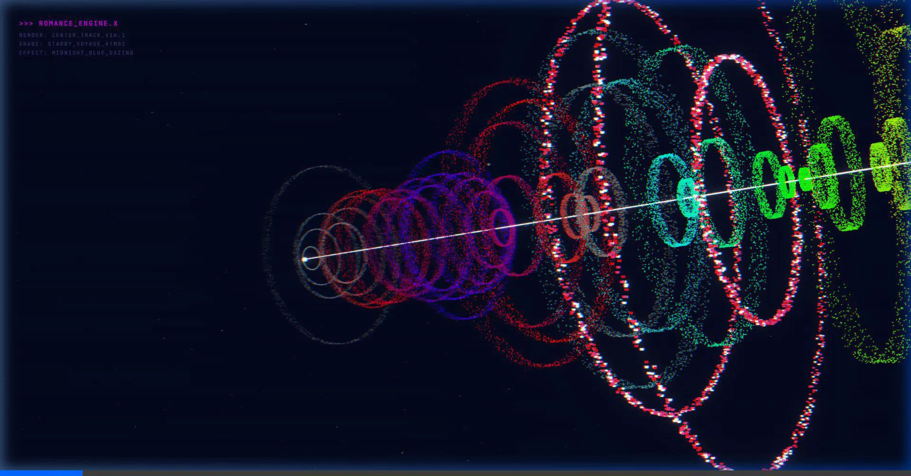

# Meteor Romance - v16.1

A digital art piece built with **Three.js**, simulating a romantic cinematic journey through space featuring brilliant starfields and a unique **Heart Ring** effect.

## Key Features
- **Cinematic Experience**: A dynamic camera system that follows the meteor with cinematic offsets.
- **Heart Ring Engine**: A rare "Surprise" effect (5% chance) that spawns rings composed of thousands of glowing heart-shaped particles with a rhythmic heartbeat animation.
- **Starry Voyage Atmosphere**: A dense, vibrant starfield with parallax effects providing deep spatial immersion.
- **VHS Aesthetic**: Retro-style post-processing for a nostalgic, lo-fi look.

## Technologies Used
- [Three.js](https://threejs.org/)
- WebGL
- Custom Shaders (VHS glitch, Space Tear)
- Post-processing (UnrealBloomPass)

## How to Run
Simply open `meteor-romance-v16.html` in any modern web browser that supports WebGL. Using **Live Server** (VS Code extension) is highly recommended for the best experience.

---
*Created with ❤️ by Antigravity*
